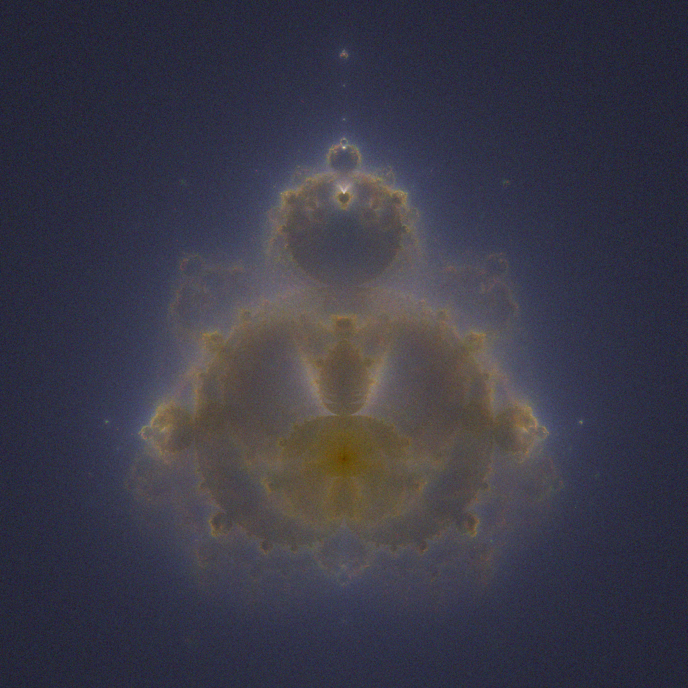
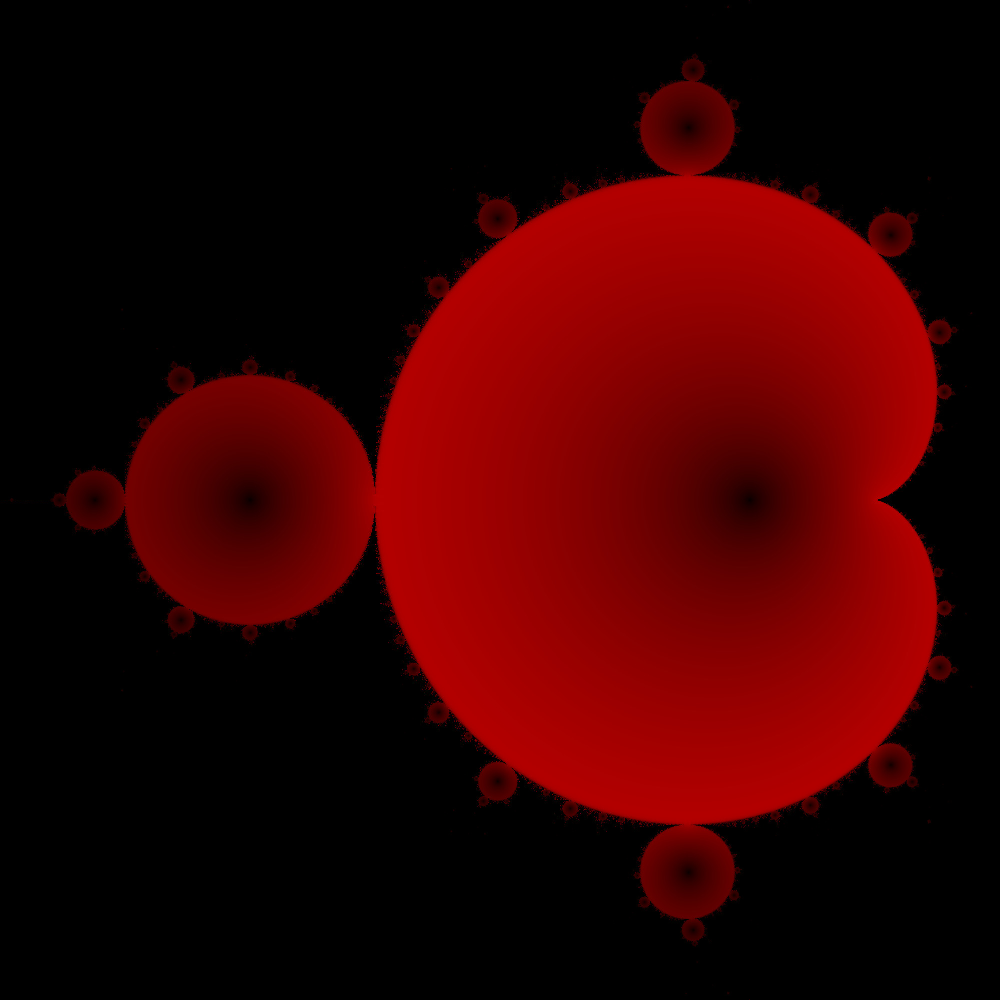
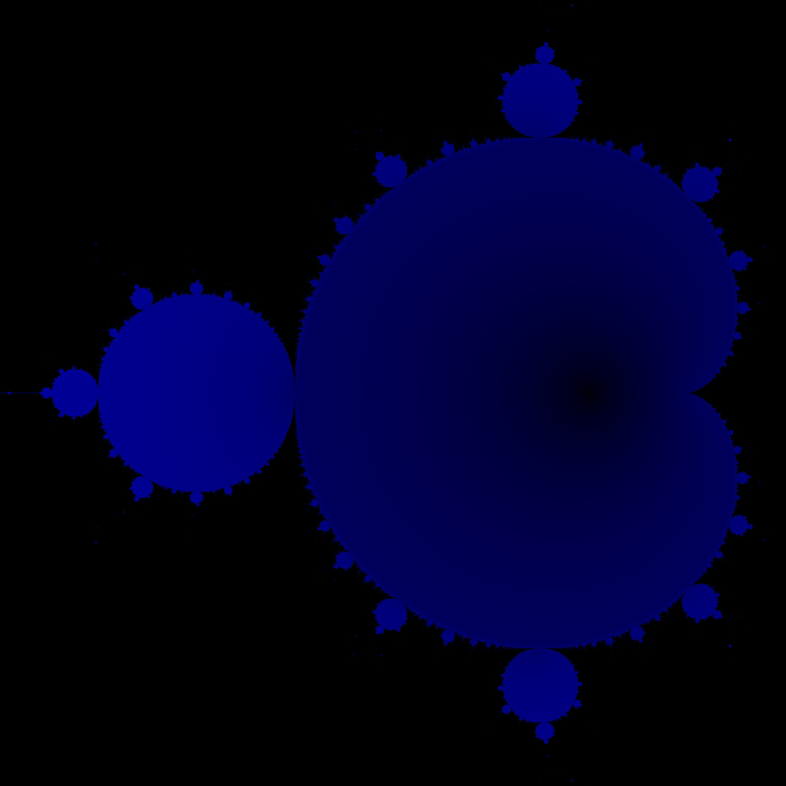

# Mandelbrot
Some simple, fun Julia code for generating Mandelbrot set related imagery.  This was
basically a "weekend project" and is more of a nice demonstration of
[Julia](https://julialang.org) than anything else.

Everything here works simply by mapping the values of individual pixels.  As such, the
images may look a little "grainy" depending on how many iterations are used.  This can be
remedied either by doing more iterations (or plotting more points) or with some sort of
image post-processing.

## Simple Uses
One can check if a complex number `z` (specifically, any Julia `Number`) is in the mandelbrot
set by doing
```julia
using Mandelbrot

z ∈ mandelbrot
```
By default membership in the set is estimated from 10^3 iterations (without any tests for
convergence).  One can change the number of iterations by doing `∈(z, mandelbrot,
n_iter)`.

One can generate the so-called "[buddhabrot](https://en.wikipedia.org/wiki/Buddhabrot)"
image by doing
```julia
h = buddha(10^7)  # "buddhabrot" of 10^7 points drawn from the uniform distribution

h₁ = buddha(𝓅, 10^7)  # "buddhabrot" of 10^7 points drawn from distribution 𝓅
```
When generating the "buddhabrot" a histogram is made of mandelbrot trajectories from some
number `z`.  By default these numbers are drawn from a uniform distribution, but they can
be drawn from any other 2-dimensional distribution using the
[Distributions.jl](https://github.com/JuliaStats/Distributions.jl) package.

Note that the generation of trajectories will take place on parallel threads, but the
histogram is generated sequentially.

## Histogram
The "buddhabrot" is a simple histogram, and for this I created a simple `histogram`
function using a simple binary search.  Both of these functions can be found in
`src/utils.jl`.  The binary search seems to have fairly good performance, but I did not go
crazy optimizing it.


## Images







